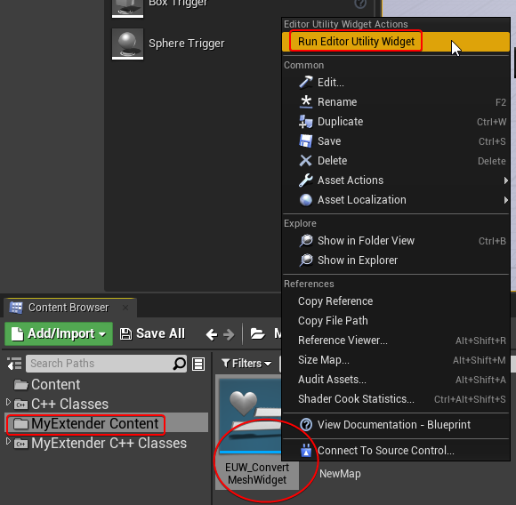
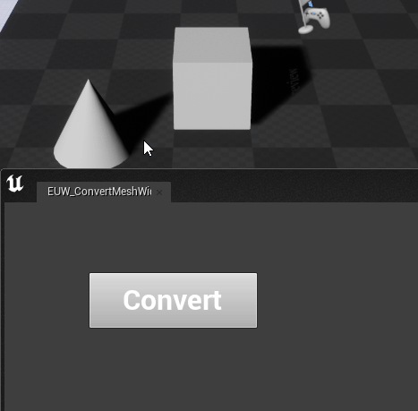
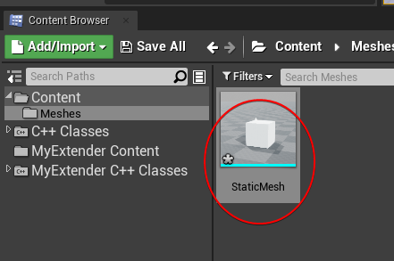
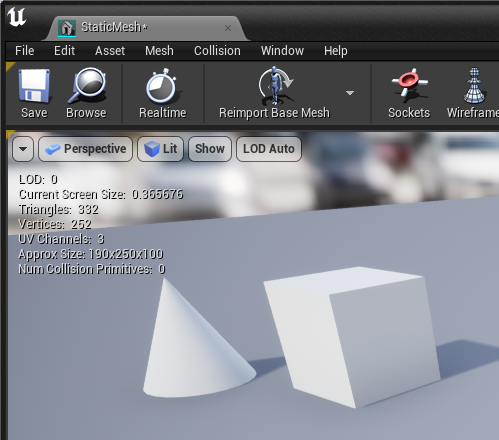

# Overview

UE4 Editor extension examples

# How to run

1. Right click **EUW_ConvertMeshWidget** -> **Run Editor Utility Widget**.

2. Select target meshes (also can select skeletal mesh) in level, then click **Convert** button to output static mesh.

3. The output static mesh will be generated in **Content/Meshes/**.

4. Result:
